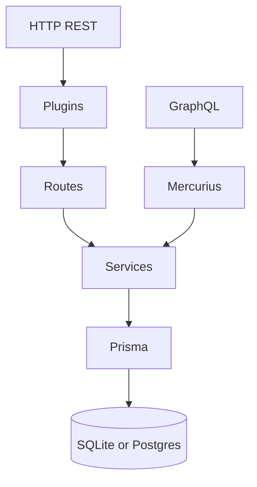

# Architecture

Notes on how the code is organized and why. Specific decisions with more context live as ADRs in `docs/adr/`.

## Overview

The target API is a Fastify server with REST + GraphQL in the same process. Persistence via Prisma (SQLite in dev, Postgres in prod). Tests consume this API through the typed clients in `src/clients/`, which are the same ones used in the Pact consumer tests. This avoids having two places declaring the shape of responses.

## Layers

- `src/api/routes/` defines request and response shapes. JSON Schema for Fastify's fast serialization, Zod to validate the body. No business rules here.
- `src/api/services/` concentrates rules: password hashing, status transitions, authentication. Does not know Fastify, receives and returns plain data. Testable without starting a server.
- `src/api/plugins/` groups middlewares: JWT, error handler that normalizes Zod and Prisma errors into `ErrorBody`, request id, Prometheus metrics, request-context.
- `src/api/graphql/` reuses the same services. No duplicated logic with REST.
- `prisma/` holds schema, migrations and seed. The client is used directly in services. A separate `repository` layer would not add value in this scope and would introduce indirection for no reason.

## Tests

Three different paths consume the API:

1. `tests/functional/` and `tests/graphql/` start the app via `listenApp()` (Fastify on an ephemeral port) and hit it with the axios clients. Database isolated by `DATABASE_URL=file:<absolute>/prisma/test.db`.
2. `tests/contract/consumer/` uses `PactV3` to generate JSON pacts. The clients from `src/clients/` receive the injected `mockServer.url`, so the same client code used in prod is what generates the contract.
3. `tests/contract/provider/` uses `Verifier` against the API running locally. Provider states live in `stateHandlers` that populate the database before each interaction.

`tests/helpers/` holds fixtures, Faker factories and the global Vitest setup. Builders in `src/builders/` produce payloads via a fluent API.

## Decisions that most impact the repo

Fastify instead of Express for three concrete reasons: serialization via JSON Schema, a cohesive plugin system (helmet, cors, rate-limit, jwt, swagger), and better performance under load. The embedded schema eliminates coupling between route and validation, which matters when the API itself is the test target.

Zod for body validation runs in parallel with Fastify's JSON Schema. The single reason that matters: type inference. One schema generates the TS type, the runtime validation, and can become JSON Schema in the OpenAPI spec. Yup does not have decent inference, plain ajv needs boilerplate, class-validator forces decorators. More in [`docs/adr/0003-zod-para-schemas.md`](./adr/0003-zod-para-schemas.md).

Vitest instead of Jest because ESM works without hacks, startup is faster and watch mode responds better. API compatible with Jest for the most part, migration is trivial.

Pact JS because it has the mature broker (and `can-i-deploy` as a release gate) and works outside the JVM world. More in [`docs/adr/0002-pact-vs-spring-cloud-contract.md`](./adr/0002-pact-vs-spring-cloud-contract.md).

WireMock and MSW coexist because they serve different purposes: WireMock is an HTTP process in a container that simulates an external dependency, MSW intercepts fetch/undici inside the Node process to test how a frontend would consume the API. Details in [`docs/adr/0004-wiremock-vs-msw.md`](./adr/0004-wiremock-vs-msw.md).

Helmet and rate limit registered from the first commit (treating these topics as an afterthought turns into backlog that no one tackles). This changes the tests: 429 responses and security headers are validated as contract. More in [`docs/adr/0006-rate-limit-e-headers-seguranca.md`](./adr/0006-rate-limit-e-headers-seguranca.md).

## Limits

SQLite in dev plus Postgres in prod means some SQLite-friendly things need to become Postgres things before going real: no native JSON type (manually serialized metadata is not used here, but if you touch the schema, remember it), enums are string + check, and there is no full text search. For the example this is fine. More in [`docs/adr/0005-sqlite-em-desenvolvimento.md`](./adr/0005-sqlite-em-desenvolvimento.md).

Mercurius works inside Fastify; in exchange the Apollo ecosystem (Studio, managed federation) is out. For the scope here, irrelevant.

Coverage measures only `src/`. Provider verification and k6 are behavior validations, not lines executed by the runner, so they do not count.
