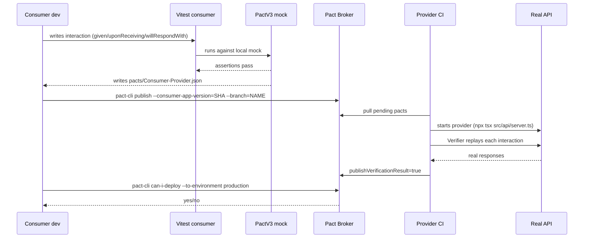

# Contract testing guide

How the repo uses Pact JS in consumer-driven mode, and what to do when something breaks.

## Consumer-driven in one sentence

The consumer (frontend, mobile, another service) writes a test against a local Pact mock. The output is a JSON that becomes the contract the provider has to honor. Without this, you only find out that prod changed response shape when the client has already broken.

The practical difference compared to an integration test is that here the consumer runs by itself against a mock (seconds), produces the artifact, and the provider validates whenever it wants (without the consumer being live). In exchange, the `can-i-deploy` gate decides automatically whether a provider version can go to production without breaking a consumer already in flight.

## Full cycle



## What Pact does not solve

Cases where I picked something else in this repo:

- Deep business rules live in functional tests against the real provider (`tests/functional/`).
- Malicious payloads, fuzzing, and rate limit live in `tests/security/`.
- Performance uses k6.
- Public API with anonymous clients: the contract is the OpenAPI spec itself, validated via BDCT.

Pact also does not help if you cannot coordinate with the team on the other side (consumer and provider need to be aligned).

## Layout in the repo

`tests/contract/consumer/` contains the tests that generate pacts. Each file corresponds to a consumer/provider pair. Example: `frontend-users.pact.spec.ts` defines the contract between `FrontendApp` and `UsersAPI`.

`tests/contract/provider/` contains the tests that run the Verifier. One file per verified provider. The Verifier reads pacts from the broker (or from the local directory in dev) and replays each interaction against the running API.

`pacts/` receives the generated JSON files. It is in `.gitignore`: pacts live in the broker, not in git. In CI, the `contract-publish.yml` workflow uploads them as an artifact and publishes them to the broker.

`docker/docker-compose.yml` provides a self-hosted Pact Broker with a dedicated Postgres. Reachable at `http://localhost:9292` with user `pact` and password `pact`.

## Writing a consumer test

Minimum structure:

```ts
import { PactV3, MatchersV3 } from '@pact-foundation/pact';
import path from 'node:path';
import { UsersClient } from '../../../src/clients/UsersClient';

const { like, uuid, datetime } = MatchersV3;
const ISO_FORMAT = "yyyy-MM-dd'T'HH:mm:ss.SSSX";

describe('Pact: FrontendApp -> UsersAPI', () => {
  const provider = new PactV3({
    consumer: 'FrontendApp',
    provider: 'UsersAPI',
    dir: path.resolve(process.cwd(), 'pacts'),
  });

  it('GET /users/:id returns a user', async () => {
    provider
      .given('a user with id 123 exists')
      .uponReceiving('a request to fetch user 123')
      .withRequest({ method: 'GET', path: '/users/123' })
      .willRespondWith({
        status: 200,
        headers: { 'Content-Type': 'application/json' },
        body: {
          id: uuid('a1b2c3d4-1234-1234-1234-1234567890ab'),
          email: like('m.castro@acme.test'),
          name: like('Mariana Castro'),
          role: like('user'),
          createdAt: datetime(ISO_FORMAT, '2026-01-15T10:30:00.000Z'),
        },
      });

    await provider.executeTest(async (mockServer) => {
      const client = new UsersClient(mockServer.url);
      const response = await client.getById('123');
      expect(response.status).toBe(200);
      expect(response.data.id).toBeDefined();
    });
  });
});
```

Key points:

- `given('text')` declares the provider state. The provider must implement a handler with the same exact text in `stateHandlers`.
- Matchers (`like`, `uuid`, `iso8601DateTime`, `eachLike`) declare rules, not literal values. The example passed is used by the mock; the rule is verified on the provider.
- The client used in the consumer test is the same real client in `src/clients/`. This guarantees that serialization, headers, and response parsing are identical to runtime.

## Implementing provider verification

```ts
import { Verifier } from '@pact-foundation/pact';
import { prisma } from '../../../src/api/prisma';

describe('Pact verification: UsersAPI', () => {
  it('honors all published contracts', () => {
    return new Verifier({
      provider: 'UsersAPI',
      providerBaseUrl: process.env.PROVIDER_URL!,
      pactBrokerUrl: process.env.PACT_BROKER_URL,
      pactBrokerToken: process.env.PACT_BROKER_TOKEN,
      publishVerificationResult: process.env.CI === 'true',
      providerVersion: process.env.GIT_SHA,
      providerVersionBranch: process.env.GIT_BRANCH,
      stateHandlers: {
        'a user with id 123 exists': async () => {
          await prisma.user.upsert({
            where: { id: '123' },
            create: {
              id: '123',
              email: 'm.castro@acme.test',
              name: 'Mariana Castro',
              passwordHash: 'x',
              role: 'user',
            },
            update: {},
          });
        },
      },
    }).verifyProvider();
  });
});
```

Key points:

- The real API has to be responding at `PROVIDER_URL` before the test runs. In CI, the `contract-verify.yml` workflow starts the API with `npx tsx src/api/server.ts` in the background and waits for `/health`.
- `stateHandlers` takes an object where each key is the exact `given` text from the consumer. The handler prepares the state and returns. Idempotency matters: the same state may run multiple times in the same run.
- `publishVerificationResult` should only be `true` in CI. Locally, keep it `false` to avoid polluting the broker.

## Pipeline and deploy gate

The `contract-publish.yml` workflow runs on every push to main and every PR:

1. Runs `npm run test:pact:consumer`.
2. Uploads `pacts/` as an artifact (always).
3. On push to `main` and if `PACT_BROKER_URL` is set, publishes to the broker with `--consumer-app-version=${GIT_SHA}` and `--branch=${GIT_REF_NAME}`.

The `contract-verify.yml` workflow runs on every push to main, every PR, and on a daily schedule:

1. Starts the API with Prisma migrate + seed.
2. Waits for `/health` to respond 200.
3. Runs `npm run test:pact:provider` with the broker envs.
4. On push to `main`, runs `pact-broker can-i-deploy --pacticipant FrontendApp --to-environment production`. The pipeline fails if the broker responds `no`.

This `can-i-deploy` is the point that separates contract testing from traditional integration testing: the broker knows the whole verification matrix (which consumer version was verified against which provider version in which environment) and answers objectively whether the promotion is safe.

## Debugging a broken contract

When the provider fails to verify a pact, the Verifier output includes:

- Consumer name and version.
- Name of the provider state that failed.
- Diff between what the pact expected and what the API returned.

Investigation playbook:

1. Reproduce locally. Start the API with `make api`. Run `npm run test:pact:provider` with `PROVIDER_URL=http://localhost:3000` and `PACT_BROKER_URL` pointing at the local broker or the specific pact JSON in `pacts/`.
2. Identify whether the failure is schema-related (a field changed type, optional became required) or status-code-related (route changed, validation changed). Schema is usually a provider bug. Status code is usually intention poorly communicated.
3. If the provider changed shape on purpose, the consumer needs to be updated first. Update the consumer test, publish the new pact version, and only then merge the provider. If the order flips, `can-i-deploy` blocks.
4. If the failure is in `stateHandlers`, the handler is not leaving the database in the expected shape. Add a log in the handler, manually validate that the subsequent GET query returns the expected payload.
5. If the failure is flaky, suspect shared state between interactions. The Verifier runs states in order; a handler that does not clean up what it created can corrupt the next.

## Step-by-step example in this repo

Say you want to add a new optional `phone` field to the response of `GET /users/:id` for use by the mobile app.

1. In the consumer test (create a new file `tests/contract/consumer/mobile-users.pact.spec.ts` with `consumer: 'MobileApp'`), add the interaction expecting `phone` as `like('+5511999999999')` when present.
2. Run `npm run test:pact:consumer`. Confirm that `pacts/MobileApp-UsersAPI.json` contains the interaction with the new field.
3. Publish locally: `GIT_SHA=local GIT_BRANCH=feat/phone npm run pact:publish` (with the local broker running via `docker compose -f docker/docker-compose.pact.yml up -d`).
4. Run `npm run test:pact:provider` with no provider change. Expected: passes, because the field is optional and the provider does not have to return it.
5. Update the Zod User schema in `src/api/schemas.ts` and the `users.service.ts` service to return `phone` when present.
6. Run the provider again. Expected: still passing.
7. Open the PR. CI publishes the new pact on the branch and runs verify. Before merge, run `npm run pact:can-i-deploy` to confirm no other consumer broke with the change.

## Bi-directional Contract Testing

The flow described so far is consumer-driven (CDCT). It requires running the Pact Verifier against the real API for every consumer/provider pair. In parallel, the repo keeps a complementary gate called Bi-directional Contract Testing (BDCT), which replaces the replay with a static comparison between the provider OpenAPI spec and the pacts published by consumers. The `contract-bidirectional.yml` workflow runs on push to main, a weekly schedule, and on demand: it generates the spec via `scripts/export-openapi.ts`, generates the pacts via `npm run test:pact:consumer`, and, when the broker is configured, publishes both with the `bdct` tag. The broker cross-references the artifacts and answers whether the spec satisfies each pact.

BDCT does not replace CDCT. The two complement each other: CDCT catches semantic divergences (business rules, ordering inside a state handler), while BDCT catches structural divergences at much lower cost (no API to start, no database to migrate). On forks or runs without a broker secret, the workflow falls back to local cross-validation via `swagger-mock-validator`, preserving the functional gate even offline.

The OpenAPI spec is also compared between the head and base ref of every PR by the `openapi-diff.yml` workflow. It posts a sticky comment with the diff (cosmetic) and the list of breaking changes (gate). Operational details, bypass via `[allow-breaking]`, and how to run the diff locally are in [`openapi-diff-bdct.md`](./openapi-diff-bdct.md).
